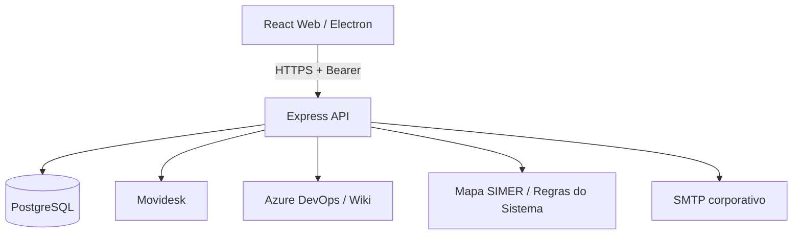

# Arquitetura

## Componentes

- `frontend`: React, Material UI, Vite, Recharts e carregamento sob demanda.
- `backend`: Express, Prisma, serviços de domínio, inteligência e schedulers.
- `desktop`: Electron; inicia o backend embarcado e gerencia atualização.
- `PostgreSQL`: usuários, sessões, tickets, Work Items, sincronizações, chat, configurações, mapas/regras e auditoria.
- `Azure DevOps`: Work Items, correlação com atendimentos e Wiki usada pela Base de Conhecimento.
- `Mapa SIMER / Regras do Sistema`: fontes internas usadas para investigação técnica e confronto entre implementação, fluxo e evidências.

As integrações Microsoft 365/SharePoint não fazem parte da arquitetura ativa desta versão.

## Limites de confiança

1. O navegador nunca recebe `DATABASE_URL`, PAT, client secret ou chaves internas.
2. Toda rota em `/api`, exceto autenticação inicial, exige sessão válida.
3. A autorização é aplicada no backend; ocultar menus no frontend não é controle de segurança.
4. Canais do chat são filtrados por associação do usuário.
5. A Central de Coordenação exige `ADMIN` ou `COORDENADOR`.
6. Integrações externas utilizam timeouts e não devem bloquear a API indefinidamente.
7. Sinais de recorrência, versão, mapa e regra são evidências de investigação; não constituem conclusão automática de causa ou Bug.

## Atualização Desktop

O aplicativo usa o canal `beta` para versões RC. A release precisa conter instalador, `.blockmap` e `beta.yml`. O manifesto é validado antes de a release ser promovida.
